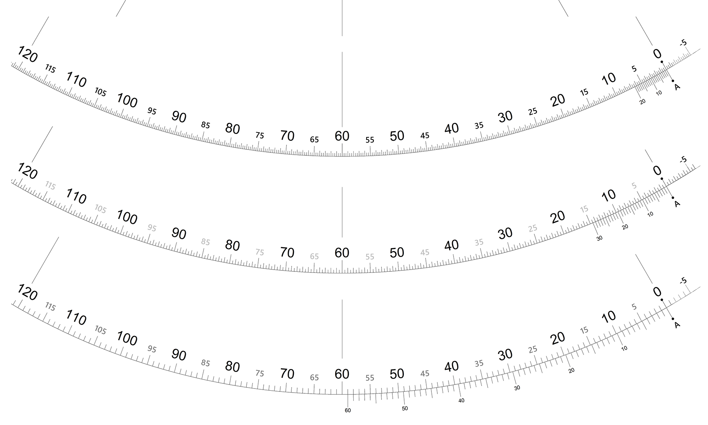
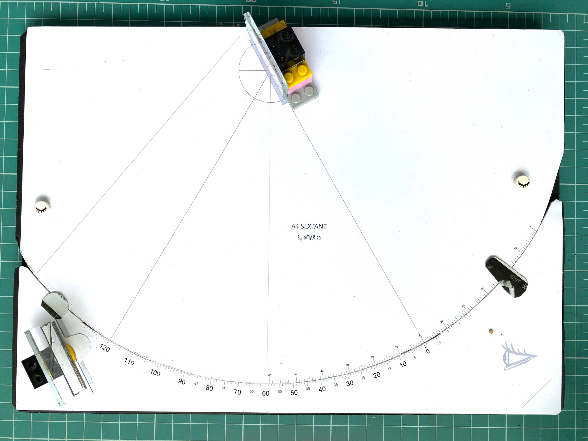

# diySextantScale

This repo contains high resolution images of marine sextant scales, for DIY instrument projects. 

Print scale image on inkjet printer and paste to your favourite frame material ( acrylic, wood, foamboard.. ) 

* Sextant scale images generated programatically to have geometrically correct proportions.
* Original size is for printing on A4 sized paper with 600 DPI resolution. 
* For better results use heavy 150 g/m2 paper, ink-jet or laser. 

Scales are *Vernier* kind with 3 options in respect to small minutes scale:

* 20' per tick ( with main scale degrees divided in 3)
* 30' per tick ( 1/2 deg divisions)
* 1 degree per tick ( w/ 60' Vernier )

For the large A3 sextant, I chose the 20'  w/ each degree divided in 3.
For A4 sextant, the full scale one degree vernier.

Which one is better ? 

# A4 sextant 
This simple DIY sextant uses common foamboard as base material.

# License
Images published by oMAR REIS under MIT License ( attribution is appreciated ) 

# Links
* A4 Sextant DIY Youtube maker video:  https://youtu.be/aTm6SjUeBZI
* A4 Sextant DIY Instructable:  https://www.instructables.com/id/A4-Sextant/
* The Foamboard Octant DIY Instructable: https://www.instructables.com/id/The-Foamboard-Octant/
* Facebook page: https://www.facebook.com/vrtoolsoftware
* tiktok of Sun observation using shade https://www.tiktok.com/@omar_reis/video/6844986821517085957

